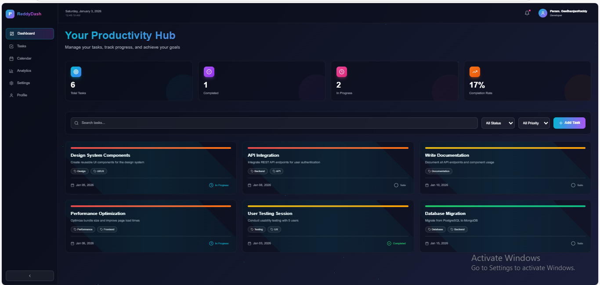
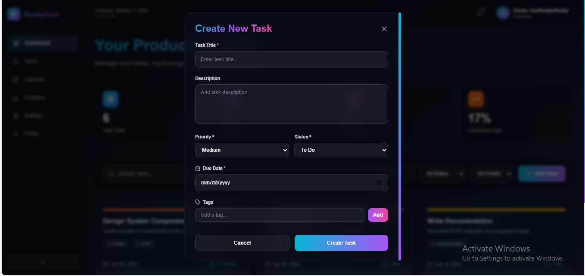
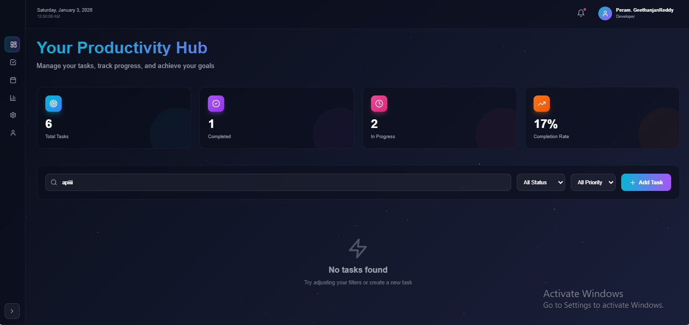

# 🚀 Productivity Dashboard

A modern, feature-rich task management and productivity dashboard built with Next.js, React, TypeScript, and Tailwind CSS. Features beautiful animations, glassmorphism design, and a futuristic aesthetic.


## 🌐 Live Demo

**[👉 View Live Demo](https://productivity-dashboard-2026.vercel.app)** ← Click here to try it!

*Experience the full application without any installation required!*

[](https://vercel.com/new/clone?repository-url=https://github.com/Geethanjanreddy/productivity-dashboard)

---


## ✨ Features

- 📊 **Dashboard Overview** - Real-time statistics and insights
- ✅ **Task Management** - Create, update, delete, and organize tasks
- 🎯 **Priority System** - High, Medium, and Low priority levels
- 🔄 **Status Tracking** - Todo, In Progress, and Completed states
- 🏷️ **Tags & Labels** - Organize tasks with custom tags
- 🔍 **Advanced Filtering** - Filter by status, priority, or search
- 📅 **Due Date Management** - Track deadlines and overdue tasks
- 🎨 **Beautiful UI** - Glassmorphism, gradients, and smooth animations
- 📱 **Responsive Design** - Works on all devices
- ⚡ **Performance Optimized** - Built with Next.js 14 App Router

## 🎨 Design Highlights

- **Futuristic Aesthetic** - Cosmic theme with neon accents
- **Smooth Animations** - Framer Motion powered interactions
- **Glassmorphism** - Modern glass-like UI components
- **Custom Gradients** - Eye-catching color combinations
- **Animated Background** - Dynamic particle effects
- **Micro-interactions** - Delightful hover and click effects

## 🛠️ Tech Stack

- **Framework:** Next.js 14 (App Router)
- **UI Library:** React 18
- **Language:** TypeScript
- **Styling:** Tailwind CSS
- **Animations:** Framer Motion
- **Icons:** Lucide React
- **Date Handling:** date-fns

## 📦 Installation

### Prerequisites

- Node.js 18+ and npm/yarn/pnpm

### Steps

1. **Clone the repository**
   ```bash
   git clone https://github.com/Geethanjanreddy/productivity-dashboard.git
   cd productivity-dashboard
   ```

2. **Install dependencies**
   ```bash
   npm install
   # or
   yarn install
   # or
   pnpm install
   ```

3. **Run the development server**
   ```bash
   npm run dev
   # or
   yarn dev
   # or
   pnpm dev
   ```

4. **Open your browser**
   Navigate to [http://localhost:3000](http://localhost:3000)

## 🚀 Build for Production

```bash
npm run build
npm start
```

## 📁 Project Structure

```
productivity-dashboard/
├── app/
│   ├── globals.css          # Global styles and animations
│   ├── layout.tsx            # Root layout
│   └── page.tsx              # Main dashboard page
├── components/
│   ├── AddTaskModal.tsx      # Modal for creating tasks
│   ├── Header.tsx            # Top navigation header
│   ├── Sidebar.tsx           # Side navigation menu
│   ├── StatCard.tsx          # Statistics card component
│   └── TaskCard.tsx          # Individual task card
├── types/
│   └── index.ts              # TypeScript type definitions
├── public/                   # Static assets
├── package.json
├── tsconfig.json
├── tailwind.config.js
├── postcss.config.js
└── next.config.js
```

## 🎯 Key Components

### TaskCard
Displays individual tasks with:
- Priority indicator (colored bar)
- Status toggle button
- Due date with overdue detection
- Tags display
- Delete functionality
- Smooth animations

### StatCard
Shows dashboard statistics with:
- Animated counters
- Icon integration
- Gradient backgrounds
- Hover effects

### AddTaskModal
Modal form for creating tasks with:
- Form validation
- Tag management
- Priority selection
- Date picker
- Animated transitions

### Sidebar
Collapsible navigation with:
- Menu items
- Active state indication
- Smooth collapse animation
- Responsive design

## 🎨 Color Palette

- **Cosmic Black:** `#0A0E1A`
- **Cosmic Blue:** `#1E3A8A`
- **Neon Cyan:** `#06B6D4`
- **Neon Purple:** `#A855F7`
- **Electric Pink:** `#EC4899`
- **Warm Orange:** `#F97316`

## 🔧 Customization

### Changing Colors

Edit `tailwind.config.js`:

```javascript
colors: {
  'your-color-name': '#HEX_CODE',
}
```

### Adding New Features

1. Create new components in `/components`
2. Add types in `/types/index.ts`
3. Update the main page in `/app/page.tsx`

### Modifying Animations

Edit animation values in:
- `tailwind.config.js` (Tailwind animations)
- Component files (Framer Motion animations)
- `app/globals.css` (CSS animations)

## 📱 Responsive Breakpoints

- **Mobile:** < 768px
- **Tablet:** 768px - 1024px
- **Desktop:** > 1024px

## ⚡ Performance Tips

- Uses Next.js 14 App Router for optimal performance
- Client components marked with `'use client'`
- Framer Motion animations optimized for 60fps
- Tailwind CSS purges unused styles in production
- Lazy loading for modal components

## 🤝 Contributing

Contributions are welcome! Please feel free to submit a Pull Request.

1. Fork the repository
2. Create your feature branch (`git checkout -b feature/AmazingFeature`)
3. Commit your changes (`git commit -m 'Add some AmazingFeature'`)
4. Push to the branch (`git push origin feature/AmazingFeature`)
5. Open a Pull Request

## 📄 License

This project is open source and available under the [MIT License](LICENSE).

## 👨‍💻 Author

**Your Name**
- GitHub: [@Geethanjanreddy](https://github.com/Geethanjanreddy)
- Portfolio: [yourportfolio.com](https://yourportfolio.com)

## 🙏 Acknowledgments

- [Next.js](https://nextjs.org/)
- [React](https://react.dev/)
- [Tailwind CSS](https://tailwindcss.com/)
- [Framer Motion](https://www.framer.com/motion/)
- [Lucide Icons](https://lucide.dev/)

## 📸 Screenshots

### 🎨 Dashboard Overview

*Modern glassmorphism design with real-time statistics and task management*

### ✨ Task Creation Modal

*Intuitive task creation with priority levels, tags, and due dates*

### 🎯 Task Cards

*Color-coded priorities, status tracking, and smooth animations*

---

**Note:** This is a portfolio project showcasing modern web development practices with Next.js, React, TypeScript, and Tailwind CSS. It demonstrates component architecture, state management, animations, and responsive design.

## 🎓 Learning Resources

If you're learning from this project, check out:
- [Next.js Documentation](https://nextjs.org/docs)
- [React Documentation](https://react.dev/)
- [TypeScript Handbook](https://www.typescriptlang.org/docs/)
- [Tailwind CSS Docs](https://tailwindcss.com/docs)
- [Framer Motion Guide](https://www.framer.com/motion/introduction/)

Happy coding! 🚀
